# diwali-sales
Diwali Sales analysis and visualization
```python
import numpy as np
import pandas as pd
import matplotlib.pyplot as plt
%matplotlib inline
import seaborn as sns
```


```python
df = pd.read_csv('Diwali Sales Data.csv',encoding='unicode_escape')
```


```python
df.shape
```


    (11251, 15)


```python
df.head()
```


<div>
<style scoped>
    .dataframe tbody tr th:only-of-type {
        vertical-align: middle;
    }

    .dataframe tbody tr th {
        vertical-align: top;
    }

    .dataframe thead th {
        text-align: right;
    }
</style>
<table border="1" class="dataframe">
  <thead>
    <tr style="text-align: right;">
      <th></th>
      <th>User_ID</th>
      <th>Cust_name</th>
      <th>Product_ID</th>
      <th>Gender</th>
      <th>Age Group</th>
      <th>Age</th>
      <th>Marital_Status</th>
      <th>State</th>
      <th>Zone</th>
      <th>Occupation</th>
      <th>Product_Category</th>
      <th>Orders</th>
      <th>Amount</th>
      <th>Status</th>
      <th>unnamed1</th>
    </tr>
  </thead>
  <tbody>
    <tr>
      <th>0</th>
      <td>1002903</td>
      <td>Sanskriti</td>
      <td>P00125942</td>
      <td>F</td>
      <td>26-35</td>
      <td>28</td>
      <td>0</td>
      <td>Maharashtra</td>
      <td>Western</td>
      <td>Healthcare</td>
      <td>Auto</td>
      <td>1</td>
      <td>23952.0</td>
      <td>NaN</td>
      <td>NaN</td>
    </tr>
    <tr>
      <th>1</th>
      <td>1000732</td>
      <td>Kartik</td>
      <td>P00110942</td>
      <td>F</td>
      <td>26-35</td>
      <td>35</td>
      <td>1</td>
      <td>Andhra Pradesh</td>
      <td>Southern</td>
      <td>Govt</td>
      <td>Auto</td>
      <td>3</td>
      <td>23934.0</td>
      <td>NaN</td>
      <td>NaN</td>
    </tr>
    <tr>
      <th>2</th>
      <td>1001990</td>
      <td>Bindu</td>
      <td>P00118542</td>
      <td>F</td>
      <td>26-35</td>
      <td>35</td>
      <td>1</td>
      <td>Uttar Pradesh</td>
      <td>Central</td>
      <td>Automobile</td>
      <td>Auto</td>
      <td>3</td>
      <td>23924.0</td>
      <td>NaN</td>
      <td>NaN</td>
    </tr>
    <tr>
      <th>3</th>
      <td>1001425</td>
      <td>Sudevi</td>
      <td>P00237842</td>
      <td>M</td>
      <td>0-17</td>
      <td>16</td>
      <td>0</td>
      <td>Karnataka</td>
      <td>Southern</td>
      <td>Construction</td>
      <td>Auto</td>
      <td>2</td>
      <td>23912.0</td>
      <td>NaN</td>
      <td>NaN</td>
    </tr>
    <tr>
      <th>4</th>
      <td>1000588</td>
      <td>Joni</td>
      <td>P00057942</td>
      <td>M</td>
      <td>26-35</td>
      <td>28</td>
      <td>1</td>
      <td>Gujarat</td>
      <td>Western</td>
      <td>Food Processing</td>
      <td>Auto</td>
      <td>2</td>
      <td>23877.0</td>
      <td>NaN</td>
      <td>NaN</td>
    </tr>
  </tbody>
</table>
</div>


```python
df.info()
```

    <class 'pandas.core.frame.DataFrame'>
    RangeIndex: 11251 entries, 0 to 11250
    Data columns (total 15 columns):
     #   Column            Non-Null Count  Dtype  
    ---  ------            --------------  -----  
     0   User_ID           11251 non-null  int64  
     1   Cust_name         11251 non-null  object 
     2   Product_ID        11251 non-null  object 
     3   Gender            11251 non-null  object 
     4   Age Group         11251 non-null  object 
     5   Age               11251 non-null  int64  
     6   Marital_Status    11251 non-null  int64  
     7   State             11251 non-null  object 
     8   Zone              11251 non-null  object 
     9   Occupation        11251 non-null  object 
     10  Product_Category  11251 non-null  object 
     11  Orders            11251 non-null  int64  
     12  Amount            11239 non-null  float64
     13  Status            0 non-null      float64
     14  unnamed1          0 non-null      float64
    dtypes: float64(3), int64(4), object(8)
    memory usage: 1.3+ MB
    


```python
df.drop(['Status', 'unnamed1'], axis=1, inplace=True)
```


```python
df.info()
```

    <class 'pandas.core.frame.DataFrame'>
    RangeIndex: 11251 entries, 0 to 11250
    Data columns (total 13 columns):
     #   Column            Non-Null Count  Dtype  
    ---  ------            --------------  -----  
     0   User_ID           11251 non-null  int64  
     1   Cust_name         11251 non-null  object 
     2   Product_ID        11251 non-null  object 
     3   Gender            11251 non-null  object 
     4   Age Group         11251 non-null  object 
     5   Age               11251 non-null  int64  
     6   Marital_Status    11251 non-null  int64  
     7   State             11251 non-null  object 
     8   Zone              11251 non-null  object 
     9   Occupation        11251 non-null  object 
     10  Product_Category  11251 non-null  object 
     11  Orders            11251 non-null  int64  
     12  Amount            11239 non-null  float64
    dtypes: float64(1), int64(4), object(8)
    memory usage: 1.1+ MB
    


```python
df.isnull()
```


<div>
<style scoped>
    .dataframe tbody tr th:only-of-type {
        vertical-align: middle;
    }

    .dataframe tbody tr th {
        vertical-align: top;
    }

    .dataframe thead th {
        text-align: right;
    }
</style>
<table border="1" class="dataframe">
  <thead>
    <tr style="text-align: right;">
      <th></th>
      <th>User_ID</th>
      <th>Cust_name</th>
      <th>Product_ID</th>
      <th>Gender</th>
      <th>Age Group</th>
      <th>Age</th>
      <th>Marital_Status</th>
      <th>State</th>
      <th>Zone</th>
      <th>Occupation</th>
      <th>Product_Category</th>
      <th>Orders</th>
      <th>Amount</th>
    </tr>
  </thead>
  <tbody>
    <tr>
      <th>0</th>
      <td>False</td>
      <td>False</td>
      <td>False</td>
      <td>False</td>
      <td>False</td>
      <td>False</td>
      <td>False</td>
      <td>False</td>
      <td>False</td>
      <td>False</td>
      <td>False</td>
      <td>False</td>
      <td>False</td>
    </tr>
    <tr>
      <th>1</th>
      <td>False</td>
      <td>False</td>
      <td>False</td>
      <td>False</td>
      <td>False</td>
      <td>False</td>
      <td>False</td>
      <td>False</td>
      <td>False</td>
      <td>False</td>
      <td>False</td>
      <td>False</td>
      <td>False</td>
    </tr>
    <tr>
      <th>2</th>
      <td>False</td>
      <td>False</td>
      <td>False</td>
      <td>False</td>
      <td>False</td>
      <td>False</td>
      <td>False</td>
      <td>False</td>
      <td>False</td>
      <td>False</td>
      <td>False</td>
      <td>False</td>
      <td>False</td>
    </tr>
    <tr>
      <th>3</th>
      <td>False</td>
      <td>False</td>
      <td>False</td>
      <td>False</td>
      <td>False</td>
      <td>False</td>
      <td>False</td>
      <td>False</td>
      <td>False</td>
      <td>False</td>
      <td>False</td>
      <td>False</td>
      <td>False</td>
    </tr>
    <tr>
      <th>4</th>
      <td>False</td>
      <td>False</td>
      <td>False</td>
      <td>False</td>
      <td>False</td>
      <td>False</td>
      <td>False</td>
      <td>False</td>
      <td>False</td>
      <td>False</td>
      <td>False</td>
      <td>False</td>
      <td>False</td>
    </tr>
    <tr>
      <th>...</th>
      <td>...</td>
      <td>...</td>
      <td>...</td>
      <td>...</td>
      <td>...</td>
      <td>...</td>
      <td>...</td>
      <td>...</td>
      <td>...</td>
      <td>...</td>
      <td>...</td>
      <td>...</td>
      <td>...</td>
    </tr>
    <tr>
      <th>11246</th>
      <td>False</td>
      <td>False</td>
      <td>False</td>
      <td>False</td>
      <td>False</td>
      <td>False</td>
      <td>False</td>
      <td>False</td>
      <td>False</td>
      <td>False</td>
      <td>False</td>
      <td>False</td>
      <td>False</td>
    </tr>
    <tr>
      <th>11247</th>
      <td>False</td>
      <td>False</td>
      <td>False</td>
      <td>False</td>
      <td>False</td>
      <td>False</td>
      <td>False</td>
      <td>False</td>
      <td>False</td>
      <td>False</td>
      <td>False</td>
      <td>False</td>
      <td>False</td>
    </tr>
    <tr>
      <th>11248</th>
      <td>False</td>
      <td>False</td>
      <td>False</td>
      <td>False</td>
      <td>False</td>
      <td>False</td>
      <td>False</td>
      <td>False</td>
      <td>False</td>
      <td>False</td>
      <td>False</td>
      <td>False</td>
      <td>False</td>
    </tr>
    <tr>
      <th>11249</th>
      <td>False</td>
      <td>False</td>
      <td>False</td>
      <td>False</td>
      <td>False</td>
      <td>False</td>
      <td>False</td>
      <td>False</td>
      <td>False</td>
      <td>False</td>
      <td>False</td>
      <td>False</td>
      <td>False</td>
    </tr>
    <tr>
      <th>11250</th>
      <td>False</td>
      <td>False</td>
      <td>False</td>
      <td>False</td>
      <td>False</td>
      <td>False</td>
      <td>False</td>
      <td>False</td>
      <td>False</td>
      <td>False</td>
      <td>False</td>
      <td>False</td>
      <td>False</td>
    </tr>
  </tbody>
</table>
<p>11251 rows × 13 columns</p>
</div>


```python
df.isnull().sum()
```


    User_ID              0
    Cust_name            0
    Product_ID           0
    Gender               0
    Age Group            0
    Age                  0
    Marital_Status       0
    State                0
    Zone                 0
    Occupation           0
    Product_Category     0
    Orders               0
    Amount              12
    dtype: int64


```python
df.shape
```


    (11251, 13)


```python
df.dropna(inplace=True)
```


```python
df.shape
```


    (11239, 13)


```python
df['Amount'] = df['Amount'].astype('int')
```


```python
df['Amount'].dtypes
```


    dtype('int32')


```python
df.columns
```


    Index(['User_ID', 'Cust_name', 'Product_ID', 'Gender', 'Age Group', 'Age',
           'Marital_Status', 'State', 'Zone', 'Occupation', 'Product_Category',
           'Orders', 'Amount'],
          dtype='object')


```python
df.rename(columns={'Marital_Status':'Shaadi'})
```


<div>
<style scoped>
    .dataframe tbody tr th:only-of-type {
        vertical-align: middle;
    }

    .dataframe tbody tr th {
        vertical-align: top;
    }

    .dataframe thead th {
        text-align: right;
    }
</style>
<table border="1" class="dataframe">
  <thead>
    <tr style="text-align: right;">
      <th></th>
      <th>User_ID</th>
      <th>Cust_name</th>
      <th>Product_ID</th>
      <th>Gender</th>
      <th>Age Group</th>
      <th>Age</th>
      <th>Shaadi</th>
      <th>State</th>
      <th>Zone</th>
      <th>Occupation</th>
      <th>Product_Category</th>
      <th>Orders</th>
      <th>Amount</th>
    </tr>
  </thead>
  <tbody>
    <tr>
      <th>0</th>
      <td>1002903</td>
      <td>Sanskriti</td>
      <td>P00125942</td>
      <td>F</td>
      <td>26-35</td>
      <td>28</td>
      <td>0</td>
      <td>Maharashtra</td>
      <td>Western</td>
      <td>Healthcare</td>
      <td>Auto</td>
      <td>1</td>
      <td>23952</td>
    </tr>
    <tr>
      <th>1</th>
      <td>1000732</td>
      <td>Kartik</td>
      <td>P00110942</td>
      <td>F</td>
      <td>26-35</td>
      <td>35</td>
      <td>1</td>
      <td>Andhra Pradesh</td>
      <td>Southern</td>
      <td>Govt</td>
      <td>Auto</td>
      <td>3</td>
      <td>23934</td>
    </tr>
    <tr>
      <th>2</th>
      <td>1001990</td>
      <td>Bindu</td>
      <td>P00118542</td>
      <td>F</td>
      <td>26-35</td>
      <td>35</td>
      <td>1</td>
      <td>Uttar Pradesh</td>
      <td>Central</td>
      <td>Automobile</td>
      <td>Auto</td>
      <td>3</td>
      <td>23924</td>
    </tr>
    <tr>
      <th>3</th>
      <td>1001425</td>
      <td>Sudevi</td>
      <td>P00237842</td>
      <td>M</td>
      <td>0-17</td>
      <td>16</td>
      <td>0</td>
      <td>Karnataka</td>
      <td>Southern</td>
      <td>Construction</td>
      <td>Auto</td>
      <td>2</td>
      <td>23912</td>
    </tr>
    <tr>
      <th>4</th>
      <td>1000588</td>
      <td>Joni</td>
      <td>P00057942</td>
      <td>M</td>
      <td>26-35</td>
      <td>28</td>
      <td>1</td>
      <td>Gujarat</td>
      <td>Western</td>
      <td>Food Processing</td>
      <td>Auto</td>
      <td>2</td>
      <td>23877</td>
    </tr>
    <tr>
      <th>...</th>
      <td>...</td>
      <td>...</td>
      <td>...</td>
      <td>...</td>
      <td>...</td>
      <td>...</td>
      <td>...</td>
      <td>...</td>
      <td>...</td>
      <td>...</td>
      <td>...</td>
      <td>...</td>
      <td>...</td>
    </tr>
    <tr>
      <th>11246</th>
      <td>1000695</td>
      <td>Manning</td>
      <td>P00296942</td>
      <td>M</td>
      <td>18-25</td>
      <td>19</td>
      <td>1</td>
      <td>Maharashtra</td>
      <td>Western</td>
      <td>Chemical</td>
      <td>Office</td>
      <td>4</td>
      <td>370</td>
    </tr>
    <tr>
      <th>11247</th>
      <td>1004089</td>
      <td>Reichenbach</td>
      <td>P00171342</td>
      <td>M</td>
      <td>26-35</td>
      <td>33</td>
      <td>0</td>
      <td>Haryana</td>
      <td>Northern</td>
      <td>Healthcare</td>
      <td>Veterinary</td>
      <td>3</td>
      <td>367</td>
    </tr>
    <tr>
      <th>11248</th>
      <td>1001209</td>
      <td>Oshin</td>
      <td>P00201342</td>
      <td>F</td>
      <td>36-45</td>
      <td>40</td>
      <td>0</td>
      <td>Madhya Pradesh</td>
      <td>Central</td>
      <td>Textile</td>
      <td>Office</td>
      <td>4</td>
      <td>213</td>
    </tr>
    <tr>
      <th>11249</th>
      <td>1004023</td>
      <td>Noonan</td>
      <td>P00059442</td>
      <td>M</td>
      <td>36-45</td>
      <td>37</td>
      <td>0</td>
      <td>Karnataka</td>
      <td>Southern</td>
      <td>Agriculture</td>
      <td>Office</td>
      <td>3</td>
      <td>206</td>
    </tr>
    <tr>
      <th>11250</th>
      <td>1002744</td>
      <td>Brumley</td>
      <td>P00281742</td>
      <td>F</td>
      <td>18-25</td>
      <td>19</td>
      <td>0</td>
      <td>Maharashtra</td>
      <td>Western</td>
      <td>Healthcare</td>
      <td>Office</td>
      <td>3</td>
      <td>188</td>
    </tr>
  </tbody>
</table>
<p>11239 rows × 13 columns</p>
</div>


```python
df.describe()
```


<div>
<style scoped>
    .dataframe tbody tr th:only-of-type {
        vertical-align: middle;
    }

    .dataframe tbody tr th {
        vertical-align: top;
    }

    .dataframe thead th {
        text-align: right;
    }
</style>
<table border="1" class="dataframe">
  <thead>
    <tr style="text-align: right;">
      <th></th>
      <th>User_ID</th>
      <th>Age</th>
      <th>Marital_Status</th>
      <th>Orders</th>
      <th>Amount</th>
    </tr>
  </thead>
  <tbody>
    <tr>
      <th>count</th>
      <td>1.123900e+04</td>
      <td>11239.000000</td>
      <td>11239.000000</td>
      <td>11239.000000</td>
      <td>11239.000000</td>
    </tr>
    <tr>
      <th>mean</th>
      <td>1.003004e+06</td>
      <td>35.410357</td>
      <td>0.420055</td>
      <td>2.489634</td>
      <td>9453.610553</td>
    </tr>
    <tr>
      <th>std</th>
      <td>1.716039e+03</td>
      <td>12.753866</td>
      <td>0.493589</td>
      <td>1.114967</td>
      <td>5222.355168</td>
    </tr>
    <tr>
      <th>min</th>
      <td>1.000001e+06</td>
      <td>12.000000</td>
      <td>0.000000</td>
      <td>1.000000</td>
      <td>188.000000</td>
    </tr>
    <tr>
      <th>25%</th>
      <td>1.001492e+06</td>
      <td>27.000000</td>
      <td>0.000000</td>
      <td>2.000000</td>
      <td>5443.000000</td>
    </tr>
    <tr>
      <th>50%</th>
      <td>1.003064e+06</td>
      <td>33.000000</td>
      <td>0.000000</td>
      <td>2.000000</td>
      <td>8109.000000</td>
    </tr>
    <tr>
      <th>75%</th>
      <td>1.004426e+06</td>
      <td>43.000000</td>
      <td>1.000000</td>
      <td>3.000000</td>
      <td>12675.000000</td>
    </tr>
    <tr>
      <th>max</th>
      <td>1.006040e+06</td>
      <td>92.000000</td>
      <td>1.000000</td>
      <td>4.000000</td>
      <td>23952.000000</td>
    </tr>
  </tbody>
</table>
</div>


```python
df[['Age', 'Orders', 'Amount']].describe()
```


<div>
<style scoped>
    .dataframe tbody tr th:only-of-type {
        vertical-align: middle;
    }

    .dataframe tbody tr th {
        vertical-align: top;
    }

    .dataframe thead th {
        text-align: right;
    }
</style>
<table border="1" class="dataframe">
  <thead>
    <tr style="text-align: right;">
      <th></th>
      <th>Age</th>
      <th>Orders</th>
      <th>Amount</th>
    </tr>
  </thead>
  <tbody>
    <tr>
      <th>count</th>
      <td>11239.000000</td>
      <td>11239.000000</td>
      <td>11239.000000</td>
    </tr>
    <tr>
      <th>mean</th>
      <td>35.410357</td>
      <td>2.489634</td>
      <td>9453.610553</td>
    </tr>
    <tr>
      <th>std</th>
      <td>12.753866</td>
      <td>1.114967</td>
      <td>5222.355168</td>
    </tr>
    <tr>
      <th>min</th>
      <td>12.000000</td>
      <td>1.000000</td>
      <td>188.000000</td>
    </tr>
    <tr>
      <th>25%</th>
      <td>27.000000</td>
      <td>2.000000</td>
      <td>5443.000000</td>
    </tr>
    <tr>
      <th>50%</th>
      <td>33.000000</td>
      <td>2.000000</td>
      <td>8109.000000</td>
    </tr>
    <tr>
      <th>75%</th>
      <td>43.000000</td>
      <td>3.000000</td>
      <td>12675.000000</td>
    </tr>
    <tr>
      <th>max</th>
      <td>92.000000</td>
      <td>4.000000</td>
      <td>23952.000000</td>
    </tr>
  </tbody>
</table>
</div>


# Exploitary Data Analysis

## GENDER


```python
ax = sns.countplot(x = 'Gender', data = df)
for bars in ax.containers:
    ax.bar_label(bars)
```


    
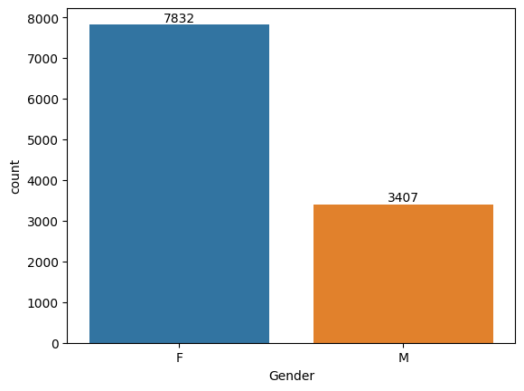
    


```python
sales_gen = df.groupby(['Gender'], as_index=False)['Amount'].sum().sort_values(by='Amount', ascending=False)
sns.barplot(x = 'Gender', y = 'Amount', data = sales_gen)
```


    <Axes: xlabel='Gender', ylabel='Amount'>


    
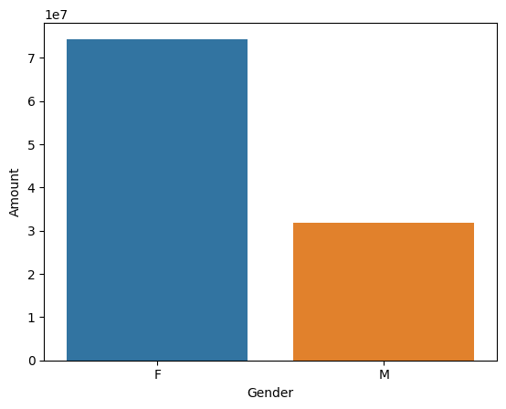
    


##### From Above graphs we can see that most of the buyers are female and even the purchasing power of females are greater than men

## Age


```python
ax = sns.countplot(x = 'Age Group', hue = 'Gender', data = df)
for bars in ax.containers:
    ax.bar_label(bars)
```


    
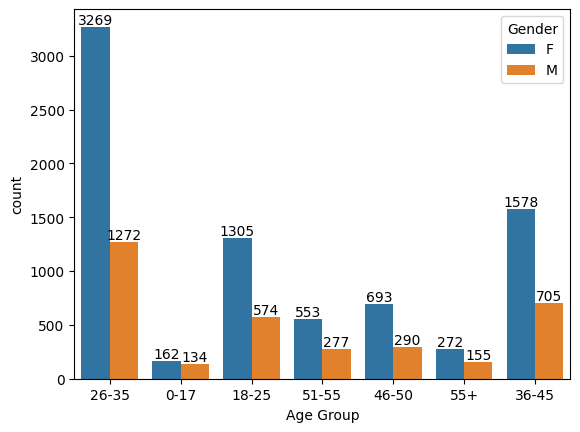
    


```python
sales_age = df.groupby(['Age Group'], as_index=False)['Amount'].sum().sort_values(by='Amount', ascending=False)
sns.barplot(x = 'Age Group', y = 'Amount', data = sales_age)
```


    <Axes: xlabel='Age Group', ylabel='Amount'>


    
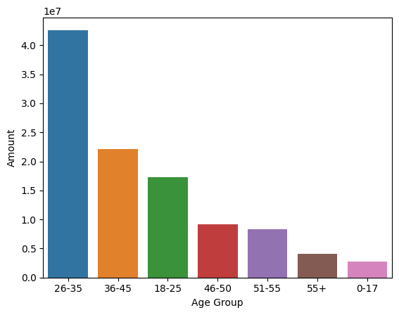
    


##### From the above ggraphs we can see that most of the buyers are of age group between 26-35 yrs females

## State


```python
sales_state = df.groupby(['State'], as_index=False)['Orders'].sum().sort_values(by='Orders', ascending=False).head(10)
sns.set(rc={'figure.figsize':(15,5)})
sns.barplot(x = 'State', y = 'Orders', data = sales_state)
```


    <Axes: xlabel='State', ylabel='Orders'>


    
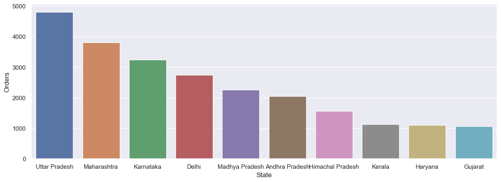
    


```python
sales_state = df.groupby(['State'], as_index=False)['Amount'].sum().sort_values(by='Amount', ascending=False).head(10)
sns.set(rc={'figure.figsize':(15,5)})
sns.barplot(x = 'State', y = 'Amount', data = sales_state)
```


    <Axes: xlabel='State', ylabel='Amount'>


    

    


##### From above graphs we can see that most of the orders and total sales/amount are from Uttar Pradesh, Maharastra, Karnataka respectively 

## Marital Status


```python
ax = sns.countplot(x = 'Marital_Status', data = df)
sns.set(rc={'figure.figsize':(10,5)})
for bars in ax.containers:
    ax.bar_label(bars)
```


    
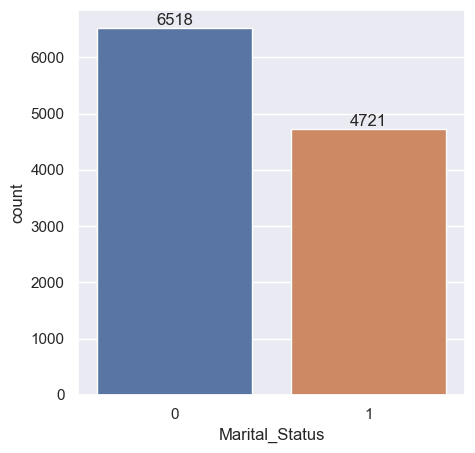
    


```python
sales_state = df.groupby(['Marital_Status', 'Gender'], as_index=False)['Amount'].sum().sort_values(by='Amount', ascending=False)
sns.set(rc={'figure.figsize':(6,5)})
sns.barplot(x = 'Marital_Status', y = 'Amount',hue='Gender', data = sales_state)
```


    <Axes: xlabel='Marital_Status', ylabel='Amount'>


    
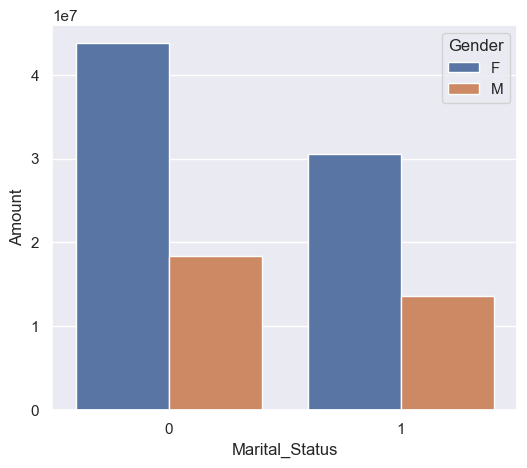
    


##### "From the above graph we can see that most of the buyers are married (Women) and they have high purchasing power"

## Occupation


```python
ax = sns.countplot(x = 'Occupation', data = df)
sns.set(rc={'figure.figsize':(25,5)})
for bars in ax.containers:
    ax.bar_label(bars)
```


    
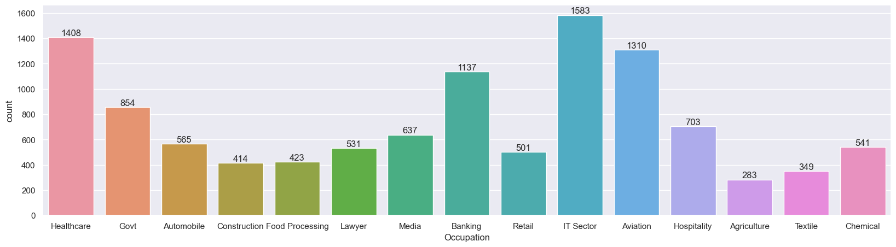
    


```python
sales_state = df.groupby(['Occupation'], as_index=False)['Amount'].sum().sort_values(by='Amount', ascending=False).head(10)
sns.set(rc={'figure.figsize':(25,5)})
sns.barplot(x = 'Occupation', y = 'Amount', data = sales_state)
```


    <Axes: xlabel='Occupation', ylabel='Amount'>


    
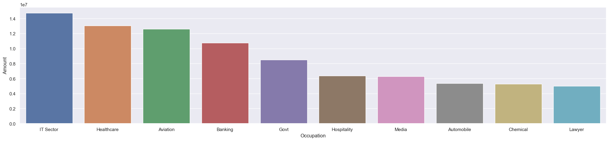
    


##### From above graphs we can see that most of the buyers are working in IT, Healthcare and Aviation sectors.

## Product Category


```python
ax = sns.countplot(x = 'Product_Category', data = df)
sns.set(rc={'figure.figsize':(25,5)})
for bars in ax.containers:
    ax.bar_label(bars)
```


    
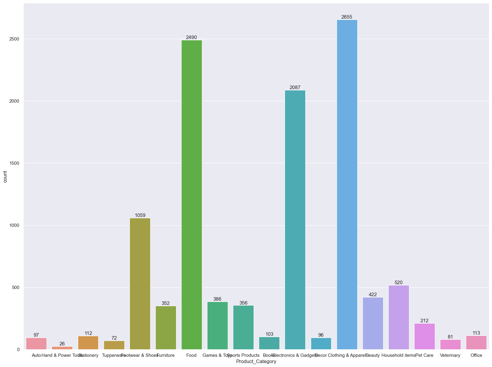
    


```python
sales_state = df.groupby(['Product_Category'], as_index=False)['Amount'].sum().sort_values(by='Amount', ascending=False).head(10)
sns.set(rc={'figure.figsize':(20,5)})
sns.barplot(x = 'Product_Category', y = 'Amount', data = sales_state)
```


    <Axes: xlabel='Product_Category', ylabel='Amount'>


    
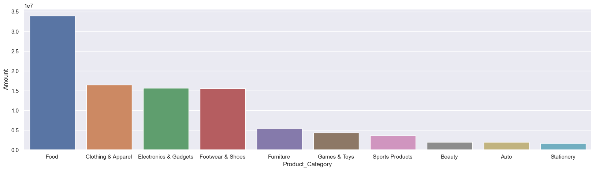
    


##### From above graphs we can see that most of the sold products are from Food, Footwear and Electronics category


```python
sales_state = df.groupby(['Product_ID'], as_index=False)['Orders'].sum().sort_values(by='Orders', ascending=False).head(10)
sns.set(rc={'figure.figsize':(20,5)})
sns.barplot(x = 'Product_ID', y = 'Orders', data = sales_state)
```


    <Axes: xlabel='Product_ID', ylabel='Orders'>


    
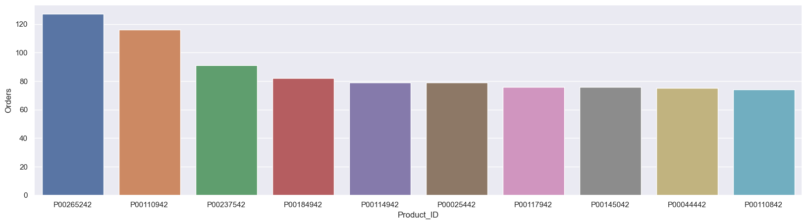
    


```python
fig1, ax1 = plt.subplots(figsize=(15,7))
df.groupby('Product_ID')['Orders'].sum().nlargest(10).sort_values(ascending=False).plot(kind='bar')
```


    <Axes: xlabel='Product_ID'>


    
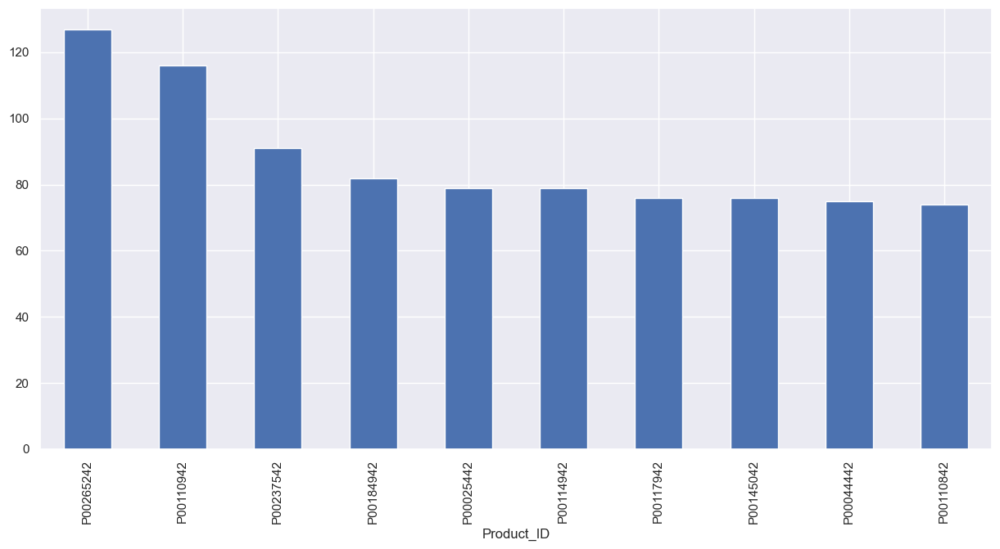
    


## Conclusion

#### Married women of age group 26-35 from UP, Maharastra, Karnataka working in IT, Healthcare and Aviation are more likely to buy products from Food, Clothing and Electronics category


```python

```
